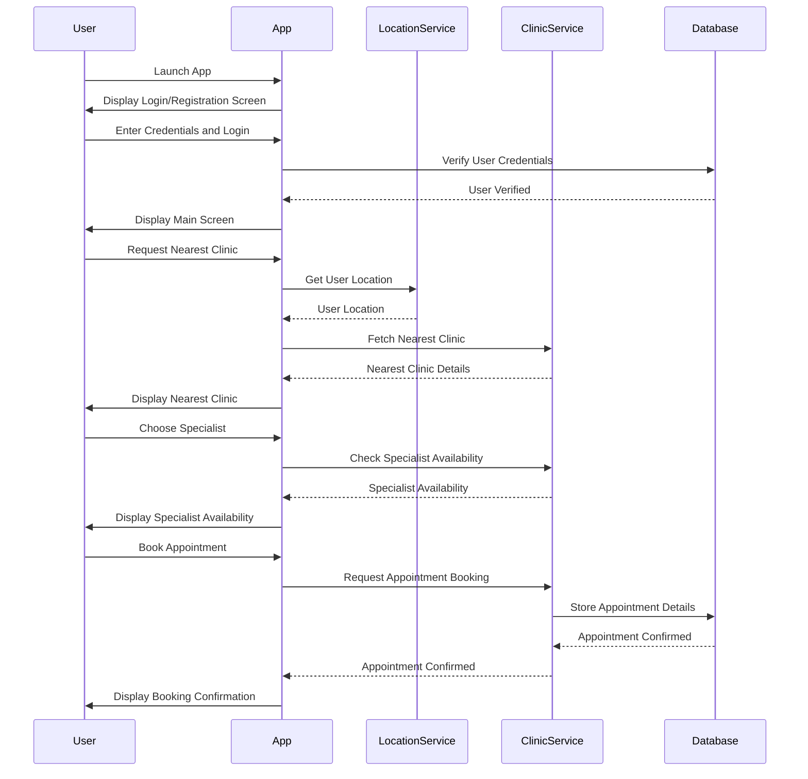
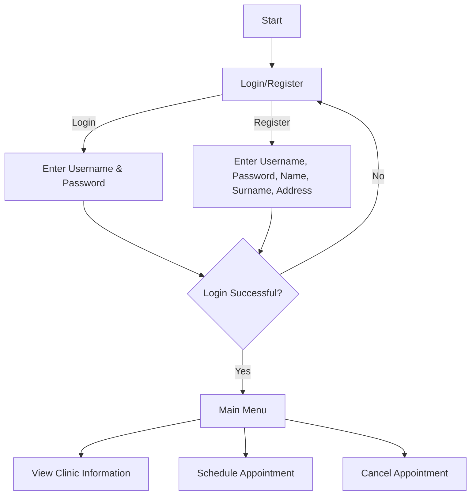

# UML diagrams
##  Sequence Diagram

## Activity Diagram

## Class Diagram

```mermaid
classDiagram
    class ViewController {
        +imageView: UIImageView
        +viewDidLoad(): void
    }

    class ClientController {
        -database: DatabaseManager
        +registerUser(login: String, passHash: String, clinicId: Int, name: String, address: String, addressCoords: String): Client
        +getUserById(userId: Int): Client
        +getUserByLogin(login: String): Client
    }
    
    class ClinicController {
        -database: DatabaseManager
        +addClinic(name: String, address: String, description: String, addressCoords: String, isPediatric: Bool, isHospital: Bool): Clinic
        +getAllClinics(): [Clinic]
        +getClinicById(clinicId: Int): Clinic
    }
    
    class AppointmentController {
        -database: DatabaseManager
        -appointments: [Appointment]
        +createAppointment(clientId: Int, clinicId: Int, departmentId: Int, doctorName: String, date: Date, address: String): Int
        +cancelAppointment(appointmentId: Int): Bool
        +rescheduleAppointment(appointmentId: Int, newDateString: String): Bool
        +getAppointmentById(appointmentId: Int): Appointment
        +addAppointment(appointment: Appointment): void
        +getAppointmentsByClientId(clientId: Int): [Appointment]
    }
    
    class DepartmentController {
        -database: DatabaseManager
        +addDepartment(clinicId: Int, specialization: String): Department
        +getDepartmentsByClinicId(clinicId: Int): [Department]
        +getDepartmentById(id: Int): Department
    }
    
    class Validator {
        +CITIES: [String]
        +isEmpty(text: String): Bool
        +isStrongPassword(password: String): Bool
        +passwordsMatch(password: String, confirmPassword: String): Bool
        +containsOnlyLetters(text: String): Bool
        +containsOnlyNumbers(text: String): Bool
    }

    ClientController "1" --> "*" DatabaseManager : uses
    ClinicController "1" --> "*" DatabaseManager : uses
    AppointmentController "1" --> "*" DatabaseManager : uses
    DepartmentController "1" --> "*" DatabaseManager : uses

    class DatabaseManager {
        +shared: DatabaseManager
        +addUser(user: Client): Int
        +getUserById(userId: Int): Client
        +getUserByLogin(login: String): Client
        +addClinic(clinic: Clinic): void
        +getAllClinics(): [Clinic]
        +getClinicById(clinicId: Int): Clinic
        +addAppointment(appointment: Appointment): Int
        +deleteAppointment(appointmentId: Int): Bool
        +rescheduleAppointment(appointmentId: Int, newDateString: String): Bool
        +getAppointmentById(appointmentId: Int): Appointment
        +getAppointmentsByUserId(clientId: Int): [Appointment]
        +addDepartment(department: Department): void
        +getDepartmentsByClinicId(clinicId: Int): [Department]
        +getDepartmentById(id: Int): Department
    }

    class Client {
        +id: Int
        +login: String
        +passHash: String
        +clinicId: Int
        +name: String
        +address: String
    }
    
    class Clinic {
        +id: Int
        +name: String
        +address: String
        +description: String
        +addressCoords: String
        +isPediatric: Bool
        +isHospital: Bool
    }

    class Appointment {
        +id: Int
        +clientId: Int
        +clinicId: Int
        +departmentId: Int
        +doctorName: String
        +date: String
    }

    class Department {
        +id: Int
        +clinicId: Int
        +specialization: String
    }

    class LoginRegisterViewController {
        -isAgreed: Bool
        -isSuccessful: Bool
        -selectedClinic: Clinic?
        -segmentedControl: UISegmentedControl
        -loginTextField: UITextField
        -passwordTextField: UITextField
        -loginButton: UIButton
        -agreementSwitch: UISwitch
        -registerView: UIView
        -registerLoginTextField: UITextField
        -registerPasswordTextField: UITextField
        -registerConfirmPasswordTextField: UITextField
        -nameTextField: UITextField
        -surnameTextField: UITextField
        -streetTextField: UITextField
        -houseNumberTextField: UITextField
        -cityTextField: UITextField
        -registerButton: UIButton
        -selectClinicButton: UIButton
        -clinics: [Clinic]
        +viewDidLoad(): void
        +updateView(): void
        +loginButtonTapped(_ sender: UIButton): void
        +registerButtonTapped(_ sender: UIButton): void
        +hashPassword(_ password: String): String
        +addressToCoords(address: String, completion: @escaping (CLLocationCoordinate2D?, Error?) -> Void): void
        +showError(_ message: String): void
        +prepare(for segue: UIStoryboardSegue, sender: Any?): void
        +shouldPerformSegue(withIdentifier identifier: String, sender: Any?): Bool
        +selectClinicTapped(_ sender: UIButton): void
        +clinicSelected(_ clinic: Clinic): void
    }

    class ClientInfoViewController {
        -user: Client!
        -clinic: Clinic!
        -departments: [Department] = []
        -appointments: [Appointment] = []
        +viewDidLoad(): void
        +loadData(): void
        +prepare(for segue: UIStoryboardSegue, sender: Any?): void
        +shouldPerformSegue(withIdentifier identifier: String, sender: Any?): Bool
        +displayAppointmentDetails(_ appointment: Appointment): void
    }
    
    class ClinicsViewController {
        -clinics: [Clinic] = []
        -selectedClinic: Clinic?
        +updateClinicDetails(with clinic: Clinic?): void
        +chooseButtonTapped(_ sender: UIButton): void
    }
    
    class ClinicsMapViewController {
        -clinics: [Clinic] = []
        -selectedClinic: Clinic!
        -locationManager: CLLocationManager!
        +parseCoordinates(from addressCoords: String): CLLocationCoordinate2D?
        +highlightNearestClinic(to userLocation: CLLocationCoordinate2D): void
    }
    
    class EditAppointmentViewController {
        +datePicker: UIDatePicker
        +viewDidLoad(): void
        +datePickerChanged(_ picker: UIDatePicker): void
        +editAppointment(_ sender: Any): void
    }
    
    class CreateAppointmentViewController {
        +appointment: Appointment
        +departments: [Department]
        +viewDidLoad(): void
        +setupTableView(): void
        +chooseDepartment(_ sender: Any): void
        +newAppointment(_ sender: Any): void
        +datePickerChanged(_ picker: UIDatePicker): void
        +showError(_ message: String): void
    }

    ViewController <|-- LoginRegisterViewController
    LoginRegisterViewController <-- ClientInfoViewController
    LoginRegisterViewController <-- ClinicsViewController
    LoginRegisterViewController <-- ClinicsMapViewController
    ClientInfoViewController <-- EditAppointmentViewController
    ClientInfoViewController <-- CreateAppointmentViewController
    ClinicsViewController <-- ClinicsMapViewController
    ClinicsViewController <-- ClientInfoViewController
```

## Component diagram

# Additional Specification

## 1. Constraints
- The application must be compatible with MacOS 10.15 or newer.
- The application must use SQLite as the database for storing user and appointment data.
- The application must be developed in Swift 5.0 or newer.
- The application must be able to function offline for viewing previously stored data but require an internet connection for syncing data with external services or for real-time location services.

## 2. Security Requirements
- All user data must be encrypted both at rest and in transit.
- Passwords must be stored securely.
- User access must be controlled through a robust authentication mechanism.
- User personal information must be protected and only accessible to authorized personnel.
- Users must have control over their data, including the ability to view, modify, and delete their information.
- The application must implement and display a clear privacy policy outlining data usage and protection measures.

## 3. Reliability Requirements
- The application must have an uptime of at least 99.5%, ensuring that it is available for users to book, cancel, or reschedule appointments at any time.
- The application must implement mechanisms for graceful degradation in case of service outages or failures.
- The application must ensure the accuracy and consistency of data across all transactions.
- Automated backups must be performed regularly to prevent data loss, with the ability to restore data in case of corruption or accidental deletion.
- The application must handle errors gracefully, providing informative error messages and guidance on how to resolve issues.

## 4. Performance Requirements
- The application must respond to user actions within 1 second for most operations.
- Appointment booking and data retrieval operations must be completed within 2 seconds.
- The application architecture must be designed to support future scalability, allowing for the addition of new features and handling increased user loads.

## 5. Usability Requirements
- The user interface must be intuitive and user-friendly.
- The application must provide consistent and clear navigation, with user-friendly prompts and feedback.
- The application must support multiple languages, allowing users to choose their preferred language for the interface.
- The application must handle locale-specific formats for dates, times, and addresses.

## 6. Maintainability and Support
- The application code must be well-documented and follow coding standards to ensure maintainability.
- Automated tests must be implemented to ensure code reliability and facilitate future updates.
- The application must support seamless updates, allowing users to receive new features and security patches without disrupting their experience.
- The application must provide a mechanism for rolling back updates in case of issues.
